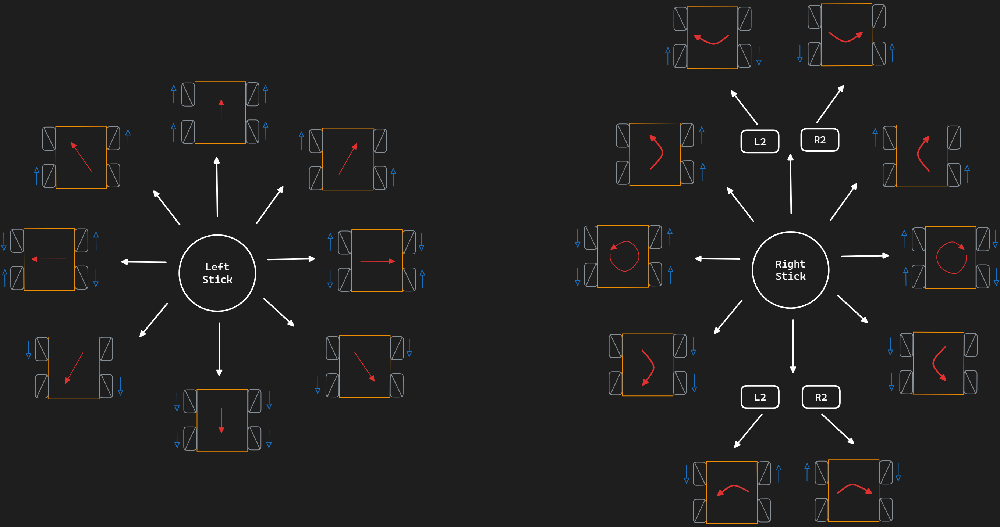

# Omnidirectional Robot Car with Recall Features

This project is a proof of concept for an omnidirectional robot capable of recording its own movements and playing them back in multiple modes. It can repeat the exact motion sequences, play it back in reverse, or in a loop, for a wide range of applications. 

The robot can be sent back to its origin or station by retracing the exact same path it took, mechanisms can be used to undo or redo the last sequence of movements, or captured motion sequences can serve as training data for machine learning models in autonomous driving—among other applications.


# User-guide 

## 🎮 Controls 

 `<PS3 Controller>`


### Manual Drive

```
🔼 D-pad                         : ⬆️ forward, ⬇️ backward, ⬅️ left, ➡️ right
```

```
🕹️ L-joystick                    : ⬆️ forward, ⬇️ backward, ⬅️ left, ➡️ right, 
                                    diagonal ↗️ 45°, ↖️ 135°, ↙️ 225°, ↘️ 315°
```

```
🕹️ R-joystick                    : 🔁🔄 rotate, ↩️↪️ pivot
```

```
🕹️ R-joystick + L2 / R2          : ⤴️⤵️ strafe
```
### Recording 

```
⭕ Circle                        : ⏺️ start recording
```

```
❌ Cross                         : ⏹️ stop recording
```

### Playback

```
🟥 Square                        : ▶️ replay
```

```
🔺 Triangle                      : ◀️ reverse
```

```
▶️◀️ L1 / R1        : 🔁 loop
```

# Developer-guide 
[TODO]
## Schematic


# References
---
**Libraries:**
* `esp32-ps3`: https://github.com/jvpernis/esp32-ps3/tree/master
* `LittleFS`: https://github.com/littlefs-project/littlefs
* `CytronMotorDriver`: https://github.com/CytronTechnologies/CytronMotorDriver/tree/master

**Tutorials:**
* https://dronebotworkshop.com/mecanum/
* https://dronebotworkshop.com/ps3-esp32/
* https://randomnerdtutorials.com/esp32-write-data-littlefs-arduino/
* https://randomnerdtutorials.com/esp32-pinout-reference-gpios/